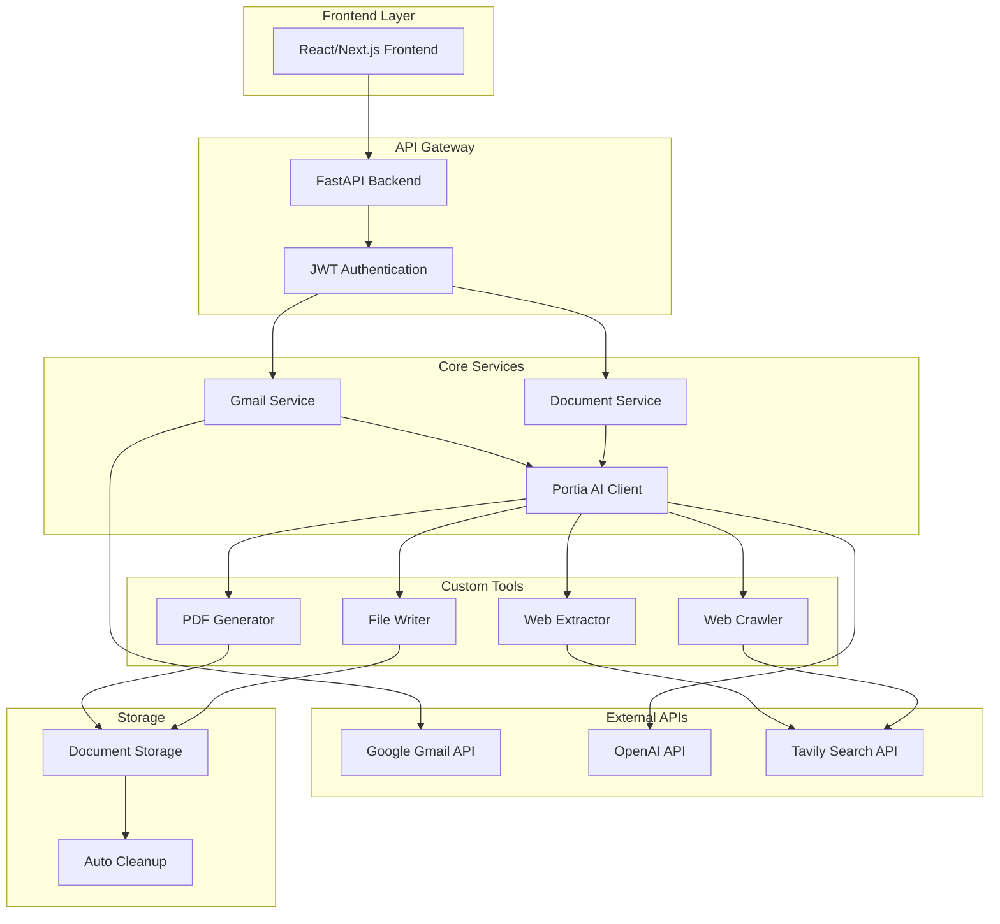
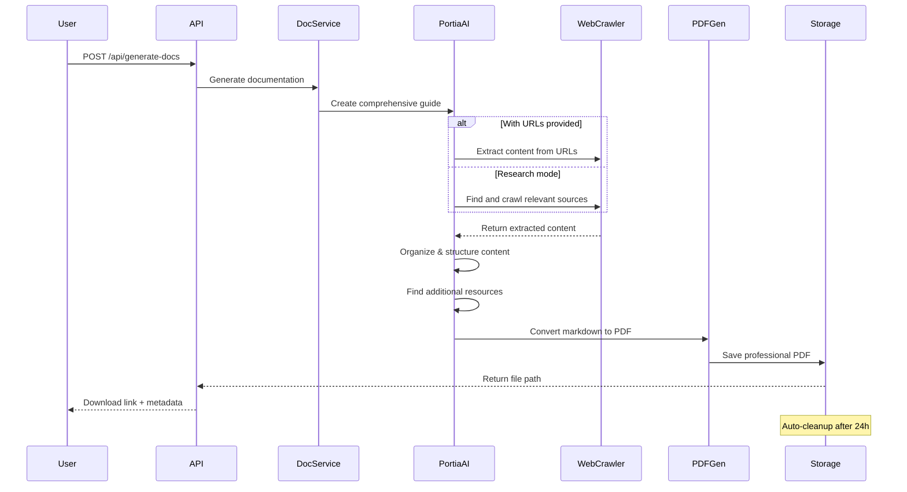
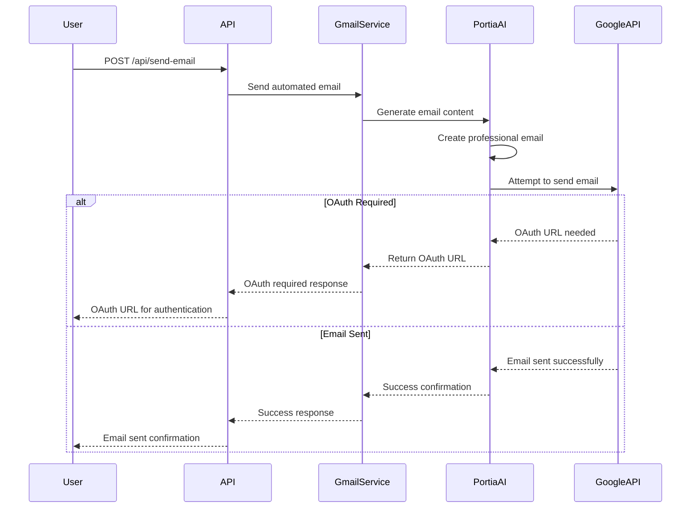

# 🚀 Portia AI Backend

> **Intelligent Document Generation & Email Automation Platform**
> 
> **🏆 AgentHack Hackathon Submission**

A powerful FastAPI backend that combines **Portia AI**, **Gmail integration**, and **intelligent document generation** to create a comprehensive automation platform. Generate professional PDFs from web content, send automated emails, and manage everything through secure JWT authentication.

**Built during AgentHack 2024** - A complete AI automation platform developed in just 48 hours!

[](https://python.org)
[](https://fastapi.tiangolo.com)
[](https://portia.ai)
[](LICENSE)

---

## 🌟 Features

### 📧 **Smart Email Automation**
- **AI-powered email generation** based on subject lines
- **Gmail integration** with OAuth2 authentication
- **Real-time OAuth URL detection** for seamless auth flow
- **Professional email templates** with context-aware content

### 📄 **Intelligent Document Generation**
- **Web content extraction** from any URL
- **Intelligent web crawling** for comprehensive research
- **Professional PDF generation** with custom styling
- **Resource aggregation** (YouTube videos, blogs, tutorials)
- **Auto-cleanup** system for storage management

### 🔐 **Enterprise Security**
- **JWT-based authentication** with secure token management
- **User isolation** and data protection
- **OAuth2 integration** for Gmail services
- **API key management** for external services

### 🛠️ **Developer Experience**
- **RESTful API design** with comprehensive documentation
- **Async/await support** for high performance
- **Custom Portia tools** for extensible functionality
- **Error handling** with detailed responses

---

## 🏗️ Architecture Overview



---

## 🔄 Document Generation Flow



---

## 📧 Email Automation Flow



---

## 🚀 Quick Start

### Prerequisites

- **Python 3.12+**
- **uv** (Python package manager)
- **OpenAI API Key**
- **Portia API Key**
- **Tavily API Key** (for web crawling)

### Installation

```bash
# Clone the repository
git clone https://github.com/yourusername/portia-ai-backend.git
cd portia-ai-backend

# Install dependencies with uv
uv sync

# Install additional PDF dependencies
uv add reportlab markdown

# Create environment file
cp .env.example .env
```

### Environment Setup

```env
# API Keys
OPENAI_API_KEY=your_openai_api_key_here
PORTIA_API_KEY=your_portia_api_key_here
TAVILY_API_KEY=your_tavily_api_key_here

# JWT Configuration
SECRET_KEY=your_super_secret_jwt_key_here
ALGORITHM=HS256
ACCESS_TOKEN_EXPIRE_MINUTES=30

# Optional: Database URL (if using database)
DATABASE_URL=sqlite:///./app.db
```

### Run the Application

```bash
# Development
uv run uvicorn main:app --reload

# Production
uv run uvicorn main:app --host 0.0.0.0 --port 8000
```

The API will be available at `http://localhost:8000`

---

## 📚 API Documentation

### Authentication Endpoints

| Method | Endpoint | Description |
|--------|----------|-------------|
| `POST` | `/auth/register` | Register new user |
| `POST` | `/auth/login` | User login |

### Email Automation

| Method | Endpoint | Description |
|--------|----------|-------------|
| `POST` | `/api/send-email` | Send AI-generated email |

**Request Body:**
```json
{
  "to": "recipient@example.com",
  "subject": "Meeting Follow-up"
}
```

**Response:**
```json
{
  "success": true,
  "result": "Email sent successfully",
  "needs_authentication": false,
  "oauth_url": null
}
```

### Document Generation

| Method | Endpoint | Description |
|--------|----------|-------------|
| `POST` | `/api/generate-docs` | Generate documentation |
| `GET` | `/api/download-docs/{filename}` | Download generated file |
| `POST` | `/api/cleanup-docs` | Manual cleanup |

**Request Body:**
```json
{
  "topic": "React Hooks Guide",
  "urls": ["https://react.dev/reference/react"],
  "output_format": "pdf"
}
```

**Response:**
```json
{
  "success": true,
  "result": "Successfully generated PDF",
  "file_path": "docs/react_hooks_guide_documentation.pdf"
}
```

---

## 🛠️ Project Structure

```
portia-ai-backend/
├── 📁 custom_tools/           # Custom Portia AI tools
│   ├── crawl_tool.py         # Web crawling functionality
│   ├── extract_tool.py       # Content extraction
│   ├── pdf_generator_tool.py # PDF generation
│   ├── file_writer_tool.py   # File operations
│   └── registry.py           # Tool registry
├── 📁 models/                # Pydantic models
│   ├── auth_models.py        # Authentication models
│   ├── gmail_models.py       # Email models
│   └── document_models.py    # Document models
├── 📁 routes/                # API route handlers
│   ├── auth_routes.py        # Authentication endpoints
│   ├── gmail_routes.py       # Email endpoints
│   └── document_routes.py    # Document endpoints
├── 📁 services/              # Business logic
│   ├── auth_service.py       # Authentication service
│   ├── gmail_service.py      # Email service
│   ├── portia_client.py      # Portia AI client
│   └── document_service.py   # Document service
├── 📁 docs/                  # Generated documents
├── main.py                   # FastAPI application
├── requirements.txt          # Dependencies
└── README.md                # This file
```

---

## 🔧 Custom Tools

### Web Extraction Tool
```python
# Extract content from specific URLs
extract_tool = ExtractTool()
content = extract_tool.run(
    urls=["https://example.com"],
    format="markdown"
)
```

### Web Crawling Tool
```python
# Intelligent web crawling
crawl_tool = CrawlTool()
results = crawl_tool.run(
    url="https://docs.example.com",
    instructions="Find all API documentation",
    max_depth=2
)
```

### PDF Generation Tool
```python
# Convert markdown to professional PDF
pdf_tool = pdf_generator_tool()
result = pdf_tool(
    markdown_content="# My Document\n\nContent here...",
    filename="my_document",
    title="My Professional Document"
)
```

---

## 🎯 Use Cases

### 📖 **Documentation Generation**
- **Technical documentation** from API docs
- **Tutorial compilation** from multiple sources
- **Research reports** with curated resources
- **Learning guides** with video links and examples

### 📧 **Email Automation**
- **Follow-up emails** based on meeting topics
- **Newsletter generation** from content themes
- **Customer support** responses
- **Marketing campaigns** with personalized content

### 🔄 **Content Aggregation**
- **Resource compilation** from web sources
- **Competitive analysis** reports
- **Market research** summaries
- **Educational materials** with multimedia links

---

### Using Docker

```dockerfile
FROM python:3.12-slim

WORKDIR /app
COPY . .

RUN pip install uv
RUN uv sync

EXPOSE 8000
CMD ["uvicorn", "main:app", "--host", "0.0.0.0", "--port", "8000"]
```

### Environment Variables for Production

```env
# Required
OPENAI_API_KEY=your_key
PORTIA_API_KEY=your_key
TAVILY_API_KEY=your_key
SECRET_KEY=your_secret


---

## 🏆 AgentHack Hackathon Submission

### 🎯 **Challenge**: Build an AI Agent Platform
**Team**: [Your Team Name]  
**Hackathon**: AgentHack 2024  
**Duration**: 48 Hours  
**Theme**: AI Automation & Productivity

### 🚀 **What We Built**
In just **48 hours**, we created a comprehensive AI automation platform featuring:

- ✅ **Intelligent Document Generation** - AI agents that research, extract, and compile professional documentation
- ✅ **Smart Email Automation** - Context-aware email generation with Gmail integration
- ✅ **Custom Portia AI Tools** - Extensible web crawling, content extraction, and PDF generation
- ✅ **Enterprise Security** - JWT authentication with OAuth2 integration
- ✅ **Production Ready** - Deployed with auto-cleanup and error handling

### 🎨 **Innovation Highlights**

**🤖 Multi-Agent Workflow**
```mermaid
graph LR
    A[Research Agent] --> B[Content Agent]
    B --> C[Writ

1. **Fork** the repository
2. **Create** a feature branch (`git checkout -b feature/amazing-feature`)
3. **Commit** your changes (`git commit -m 'Add amazing feature'`)
4. **Push** to the branch (`git push origin feature/amazing-feature`)
5. **Open** a Pull Request

---

---


<div align="center">

**Built with ❤️ using Portia AI, FastAPI, and modern Python**

[⭐ Star this repo](https://github.com/yourusername/portia-ai-backend) • [🐛 Report Bug](https://github.com/yourusername/portia-ai-backend/issues) • [✨ Request Feature](https://github.com/yourusername/portia-ai-backend/issues)

</div>